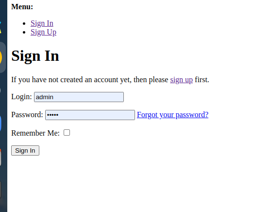
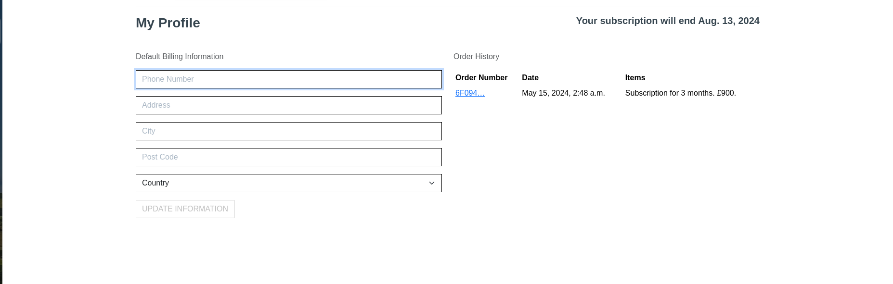
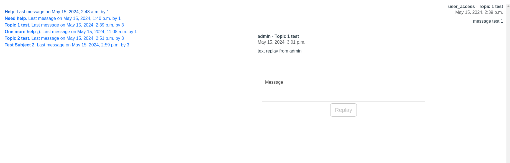
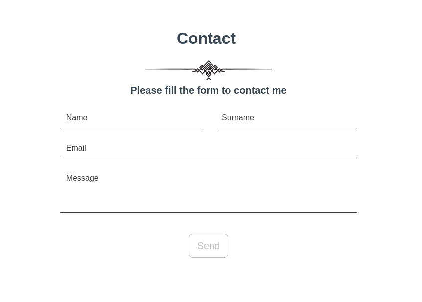
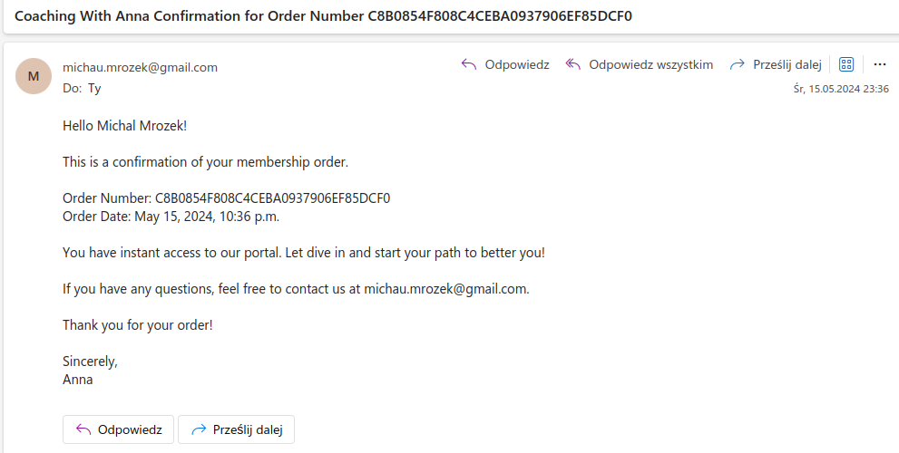
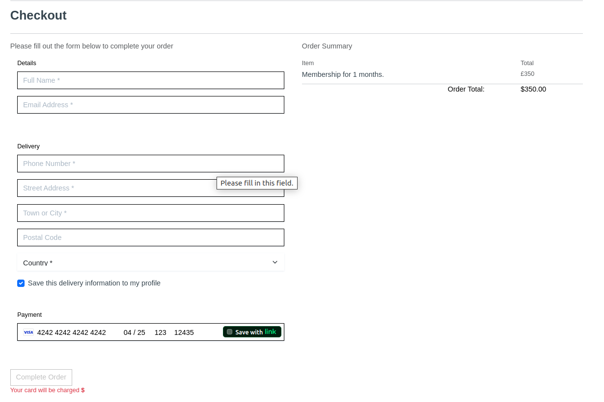

# Coaching Service Application

This is a Django-based web application designed to facilitate the management of a coaching service. It includes features for managing coaches, clients and chat directly with the coach. The application aims to provide an efficient and user-friendly platform for both coaches and students.

## Coaching Website User Story

**Title:** Coaching Website User Story

**As a** user interested in personal development and growth,
**I want to** access a coaching website with chat functionality,
**So that I can** receive real-time support and guidance from experienced coaches.

### Acceptance Criteria:

1. **As a** user, I can easily navigate to the coaching website's homepage.
2. Upon arrival, I am greeted with a clear call-to-action to begin a chat session with a coach.
3. I can initiate a chat session with them directly from my profile.
4. The chat interface should be user-friendly, allowing me to send messages, receive responses promptly.

5. If the coach is unavailable, I should have the option to send an email.
6. The website should ensure privacy and confidentiality of all conversations between users and coaches.
7. The website should be accessible on both desktop and mobile devices for users' convenience.
8. Integration with a secure payment system for paid coaching subscription.


## Table of Contents

- [Features](#features)
- [Installation](#installation)
- [Usage](#usage)
- [Project Structure](#project-structure)
- [Configuration](#configuration)
- [Running Tests](#running-tests)
- [Contributing](#contributing)
- [License](#license)

## Features

- **Navigation**: Provides an easy reference to navigate between the 'Home' and other pages


- **User Authentication**: Secure login and registration for users.



- **Profile Management**: Manage user profiles.



- **Life chat**: Life discussion between coaches and students.



- **Email comunication** 



- **Notifications**: Email notifications for orders.



- **Payment Integration**: Integration with payment stripe for subscription payments.



## Installation

### Prerequisites

- Python 3+
- Django 4.2+
- PostgreSQL (or any other preferred database)

### Setup

1. **Clone the repository:**
    ```bash
    git clone https://github.com/michal-mrozek/coaching-web-project4.git
    
    ```

2. **Create a virtual environment:**
    ```bash
    python -m venv venv
    source venv/bin/activate  # On Windows, use `venv\Scripts\activate`
    ```

3. **Install dependencies:**
    ```bash
    pip install -r requirements.txt
    ```

4. **Configure the database:**
    - Update the `DATABASES` setting in `settings.py` with your database configuration.

5. **Apply migrations:**
    ```bash
    python manage.py migrate
    ```

6. **Create a superuser:**
    ```bash
    python manage.py createsuperuser
    ```

7. **Run the development server:**
    ```bash
    python manage.py runserver
    ```

8. **Access the application:**
    Open a web browser and go to `http://127.0.0.1:8000`.

## Usage

### Admin Panel

- Access the admin panel at `http://127.0.0.1:8000/admin`.
- Use the admin panel to manage users, groups, messages,

### User Interface

- User can log in and manage their profiles.
- Students can access the chat with available coaches.
- Coaches can manage their chat.


## Configuration

### Environment Variables

Create a `.env` file in the root directory and add the following variables:

```plaintext
SECRET_KEY=your_secret_key
DATABASE_URL=your_database_url
EMAIL_HOST=smtp.your-email-provider.com
EMAIL_PORT=587
EMAIL_HOST_USER=your_email@example.com
EMAIL_HOST_PASSWORD=your_email_password
```

## Manual Tests


1 **Register a new user**

- Log in with the registered user.
- Verify that the user can log out successfully.

2 **Profile Management**

- Update user profile information.
- Verify that the changes are reflected correctly.

3 **Chat**

- Create a new chat as user.
- Answer as a coach.
- Verify that the conversation appears correctly in both coach and student chat.

4 **Notifications**

- Ensure email notifications are sent for log in and orders.
- Verify that the email content is correct.

5 **Payment Integration**

- Test the payment process using test credentials from the stripe.
- Ensure that successful payments are processed and reflected correctly in the system.
- Verify that failed payments are handled gracefully.

### Unsolved logic problem/bugs

1 **List of conversations date**

- List of open conversation fetch wrong date. The chat creation date instead of date of the last message within conversation.

2 **No styling on log in and log out pages**

- Embarrassing detail - no enough time to finish cosmetic part of authorisation.

### License
This project is licensed under the MIT License.